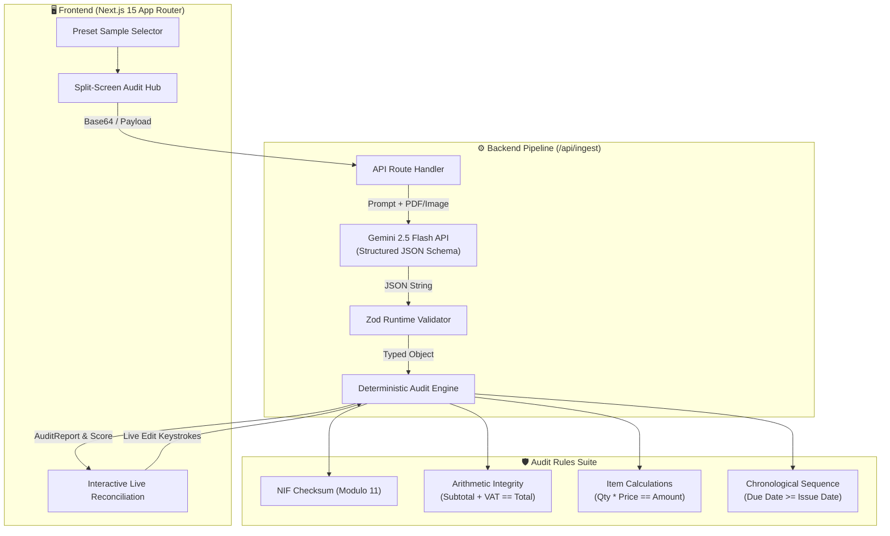

# Briefly — AI Smart Ingestion & Contract/Invoice Audit Hub 📄⚡

[](https://github.com/joaosantos1231209/briefly/actions)


> **Enterprise-grade document ingestion, structured AI extraction, and deterministic financial auditing in a unified SaaS platform.**

---

## 🌟 Overview

**Briefly** is a production-ready document processing platform engineered to bridge unstructured business documents (scanned PDFs, invoices, supplier contracts) with strict, deterministic financial audit workflows.

Instead of relying solely on Generative AI outputs—which can hallucinate dates or arithmetic—Briefly combines **Google Gemini 2.5 Flash Structured Outputs (JSON Schema)** with **runtime Zod schema validation** and an **automated deterministic audit engine** to detect calculation mismatches, expired payment terms, and invalid tax identifiers (NIF/VAT checksums).

---

## 📐 System Architecture & Data Flow



---

## ✨ Key Capabilities

- 🤖 **Structured AI Extraction:** Parses unstructured PDFs/Images into strict JSON schemas via Gemini 2.5 Flash.
- 🇵🇹 **Portuguese NIF Checksum Engine:** Validates tax identification numbers (individuals and corporations) using the official Modulo 11 checksum algorithm.
- 🧮 **Deterministic Arithmetic Integrity:** Verifies global totals (`subtotal + VAT == total`) and individual line-item calculations (`quantity * unitPrice == amount`) with floating-point tolerance.
- 📅 **Chronological Validation:** Detects inverted dates where payment due dates precede document issue dates.
- 🔄 **Human-in-the-Loop Live Reconciliation:** Real-time re-auditing on every form edit, updating health score (0–100%) and anomaly badges instantly.
- 🧪 **Zero-Cost CI/CD Testing:** Full test suite powered by **Vitest** and **MSW (Mock Service Worker)** to mock external AI APIs in CI pipelines.

---

## 💡 Technical Decisions & Trade-Offs

### 1. Why Hybrid AI + Deterministic Rules?
- **Problem:** LLMs are non-deterministic and prone to calculation mistakes or subtle hallucinated digits.
- **Solution:** We use Gemini solely for *perception and extraction* into structured JSON schemas. All business logic, tax checksums, and arithmetic validation are performed by **pure TypeScript functions** with 100% deterministic reproducibility.

### 2. Why MSW (Mock Service Worker) for Integration Tests?
- **Problem:** Running live AI API calls in CI pipelines introduces latency, flakiness, rate limits, and financial cost.
- **Solution:** MSW intercepts outgoing network calls at the network layer during tests, returning mock Gemini responses instantly with zero API cost.

### 3. Derived State over React Effects for Live Re-auditing
- **Problem:** Triggering `setState` inside `useEffect` on form edits causes unnecessary render cycles and React warnings.
- **Solution:** `auditReport` is derived inline (`const auditReport = invoice ? auditInvoice(invoice) : null`), ensuring instant 60fps re-auditing without side effects.

---

## 🛠️ Tech Stack

| Category | Technology |
|---|---|
| **Framework** | Next.js 15 (App Router, Server Actions) |
| **Language** | TypeScript (Strict Mode) |
| **Styling & UI** | Tailwind CSS v4, Lucide Icons, Glassmorphism Aesthetics |
| **AI Engine** | Google Gemini API (`@google/genai`) |
| **Schema Validation** | Zod v4 |
| **Testing & Mocks** | Vitest, Testing Library, MSW (Mock Service Worker) |
| **CI/CD** | GitHub Actions Workflow |

---

## 🚀 Quick Start

### 1. Clone & Install Dependencies
```bash
git clone https://github.com/joaosantos1231209/briefly.git
cd briefly
npm install
```

### 2. Environment Setup (Optional for Live Gemini AI)
Create a `.env.local` file:
```env
GEMINI_API_KEY=your_gemini_api_key_here
```

### 3. Run Development Server
```bash
npm run dev
```
Open [http://localhost:3000](http://localhost:3000) in your browser.

### 4. Run Test Suite & Linter
```bash
# Run unit & integration tests
npm run test:run

# Run TypeScript type check & ESLint
npx tsc --noEmit
npm run lint

# Production build test
npm run build
```

---

*Engineered with precision for modern financial and operational workflows.*
