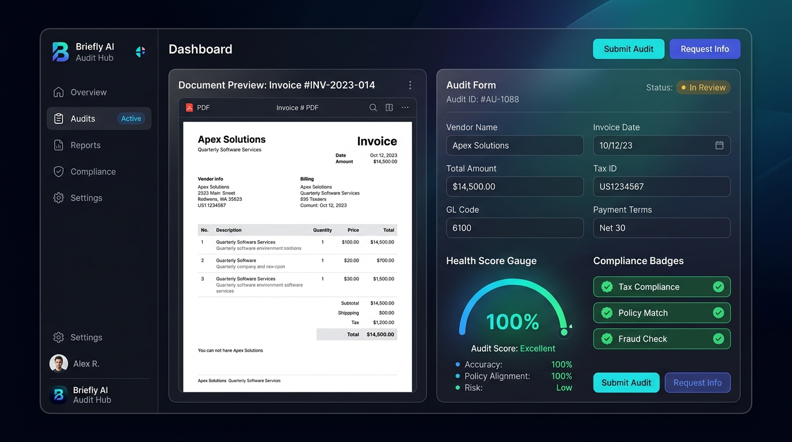

# Briefly — AI Smart Ingestion & Contract/Invoice Audit Hub 📄⚡

[](https://github.com/joaosantos1231209/briefly/actions)


> **Enterprise-grade document ingestion, structured AI extraction, and deterministic financial auditing in a unified SaaS platform.**

---

## 🎨 Visual Showcase



---

## 🌟 Visão Geral (O Problema e a Solução)

### O Problema de Negócio
A maioria das ferramentas baseadas unicamente em IA/LLMs falha quando aplicada ao setor financeiro. Os Grandes Modelos de Linguagem são por natureza **não-determinísticos**: frequentemente alucinam casas decimais, cometem erros de adição simples em sub-totais e aceitam números de identificação fiscal (NIFs) estruturalmente inválidos.

### A Solução Híbrida do Briefly
O Briefly resolve esta lacuna com uma **arquitetura híbrida de engenharia de software**:
1. **Percepção via IA (Gemini 2.5 Flash):** Forçada por **Structured Outputs (JSON Schema)** a extrair estritamente os campos do documento sem respostas em texto livre.
2. **Auditoria Determinística (TypeScript Puro):** Os dados extraídos passam por um motor de regras puras que valida o **checksum do Módulo 11 do NIF Português**, confirma a igualdade $\text{Subtotal} + \text{IVA} == \text{Total}$, recalcula cada linha de produto e verifica a cronologia de datas com **100% de precisão reprodutível**.

---

## 📐 Diagrama de Arquitetura do Sistema

```mermaid
flowchart TD
    subgraph Client["🖥️ Frontend (Next.js 15 App Router)"]
        UI["Split-Screen Audit Hub Workspace"]
        Reconciler["Interactive Live Reconciliation (Human-in-the-Loop)"]
        Presets["Preset Sample Selector (4 Faturas de Teste)"]
    end

    subgraph API["⚙️ Next.js Backend (/api/ingest)"]
        Throttler["IP Rate Limiter (10 req/min)"]
        GeminiClient["Gemini API Client (@google/genai)"]
        ZodParser["Zod Runtime Schema Parser"]
        AuditEngine["Deterministic Audit Engine"]
    end

    subgraph Domain["🛡️ Motor de Auditoria Determinístico"]
        NIFCheck["NIF Checksum (Algoritmo Módulo 11)"]
        SubtotalCheck["Validação Subtotal + IVA == Total (±0.02€)"]
        ItemCheck["Validação Qtd * PreçoUnitario == Montante"]
        DateCheck["Validação Cronológica (Vencimento >= Emissão)"]
    end

    subgraph TestSuite["🧪 Suíte de Testes & Mocks"]
        MSW["Mock Service Worker (Interceção HTTP)"]
        VitestRunner["Vitest Test Runner (11 Testes)"]
    end

    Presets --> UI
    UI -->|Base64 / Payload| Throttler
    Throttler --> GeminiClient
    GeminiClient -->|Prompt + PDF/Imagem| AI_Cloud["Google Gemini 2.5 Flash"]
    AI_Cloud -->|JSON Estruturado| ZodParser
    ZodParser -->|Typed Object| AuditEngine
    
    AuditEngine --> NIFCheck & SubtotalCheck & ItemCheck & DateCheck
    AuditEngine -->|AuditReport (Score + Flags)| Reconciler
    Reconciler -->|Edições em Tempo Real (60fps)| AuditEngine

    MSW -.->|Simula Resposta de IA| GeminiClient
    VitestRunner --> TestSuite
```

---

## 💡 Decisões Técnicas e Trade-Offs (O Diferenciador)

### 1. Por que Funções Puras para NIF e Matemática em vez de IA?
- **Trade-off:** Confiar na IA para somar valores ou validar o checksum de um NIF causaria falhas imprevisíveis em produção. 
- **Decisão:** Isolámos a IA exclusivamente para *interpretação ótica e estruturação de texto*. Toda a lógica de negócio, checksums e aritmética é executada por **funções puras em TypeScript**, garantindo execuções determinísticas com 0% de erro matemático.

### 2. Por que MSW (Mock Service Worker) nos Testes de Integração?
- **Trade-off:** Efetuar chamadas reais à Gemini API durante a suíte de testes de CI/CD introduziria latência, custos financeiros por token e falhas por rate-limits externos.
- **Decisão:** Implementámos **MSW** para intercetar o tráfego HTTP da Google ao nível de rede. A suíte completa de 11 testes corre offline em **1.61 segundos** com **$0 custos de API**.

### 3. Estado Derivado em React em vez de `useEffect` no Reconciliador
- **Trade-off:** Atualizar o estado do relatório dentro de um `useEffect` a cada tecla premida no formulário de reconciliação provocaria renders em cascata e degradação de framerate.
- **Decisão:** Derivámos o relatório diretamente no corpo do componente (`const auditReport = invoice ? auditInvoice(invoice) : null`), alcançando **re-auditoria instantânea a 60fps** sem side-effects.

---

## ✨ Capacidades Chave (Core Features)

- 🤖 **Structured AI Extraction:** Ingestão de PDFs e imagens convertidos em JSON com validação estrita via Zod.
- 🇵🇹 **Validação de NIF Português (Módulo 11):** Algoritmo oficial de verificação de checksum para contribuintes singulares e coletivos.
- 🧮 **Validação Aritmética Global e por Linha:** Verificação de $\text{Subtotal} + \text{IVA} == \text{Total}$ e $\text{Qtd} \times \text{Preço} == \text{Montante}$ com tolerância a arredondamentos.
- 📅 **Cronologia de Datas:** Alertas automáticos caso a data de vencimento seja anterior à data de emissão.
- 🔄 **Human-in-the-Loop Live Reconciliation:** Edição manual interativa de qualquer campo com re-auditoria e atualização de **Audit Score (0–100%)** em tempo real.
- 🛡️ **Hardening de Segurança:** Security Headers HTTP estritos (HSTS, CSP, X-Frame-Options DENY) e Rate Limiting de 10 req/min por IP.
- ⚖️ **Compliance RGPD & SEO:** Páginas de Política de Privacidade (não-retenção de ficheiros), Termos de Serviço, sitemap.xml, robots.txt e dados estruturados JSON-LD.

---

## 🛠️ Stack Tecnológica

| Categoria | Tecnologia / Ferramenta |
|---|---|
| **Framework Main** | Next.js 15 (App Router, Server Components) |
| **Linguagem** | TypeScript 5 (Strict Mode) |
| **Estilização** | Tailwind CSS v4, Lucide Icons, Glassmorphism Theme |
| **IA & Schemas** | Google Gemini API (`@google/genai`) + Zod v4 |
| **Testes & Mocks** | Vitest, Testing Library, MSW (Mock Service Worker) |
| **Qualidade & CI/CD** | GitHub Actions Pipeline, ESLint, TypeScript Type-checker |

---

## 🚀 Arranque Rápido (Quick Start)

### 1. Clonar o Repositório e Instalar Dependências
```bash
git clone https://github.com/joaosantos1231209/briefly.git
cd briefly
npm install
```

### 2. Configurar Variáveis de Ambiente (Opcional para IA Live)
Cria um ficheiro `.env.local` na raiz do projeto:
```env
GEMINI_API_KEY=sua_chave_gemini_api_aqui
NEXT_PUBLIC_SITE_URL=http://localhost:3000
```

### 3. Executar o Servidor de Desenvolvimento
```bash
npm run dev
```
Acede a [http://localhost:3000](http://localhost:3000) no teu navegador.

### 4. Executar a Suíte de Testes e Validações
```bash
# Executar suíte de testes unitários e de integração
npm run test:run

# Validar TypeScript e ESLint
npx tsc --noEmit
npm run lint

# Testar build de produção
npm run build
```

---

## 📁 Estrutura do Projeto

```
briefly/
├── .github/workflows/ci.yml # Pipeline de CI/CD no GitHub Actions
├── public/                  # Favicons, llms.txt e imagens de preview
├── src/
│   ├── app/                 # Next.js App Router (Dashboard, Privacy, Terms, API)
│   ├── components/          # Componentes UI (DocumentViewer, AuditForm, AuditFlagsPanel, PresetsBar)
│   ├── lib/
│   │   ├── ai/client.ts     # Cliente Gemini API com JSON Schema
│   │   └── audit/           # Motor Determinístico (nif.ts, rules.ts, schema.ts)
│   └── test/                # Suíte de Testes (Unitários + Mocks MSW)
├── next.config.ts           # Security Headers, Source Maps e compressão
├── README.md                # Ficheiro de documentação principal
└── vitest.config.ts         # Configuração do Vitest
```

---

*Engineered with precision for B2B financial and operational document workflows.*
